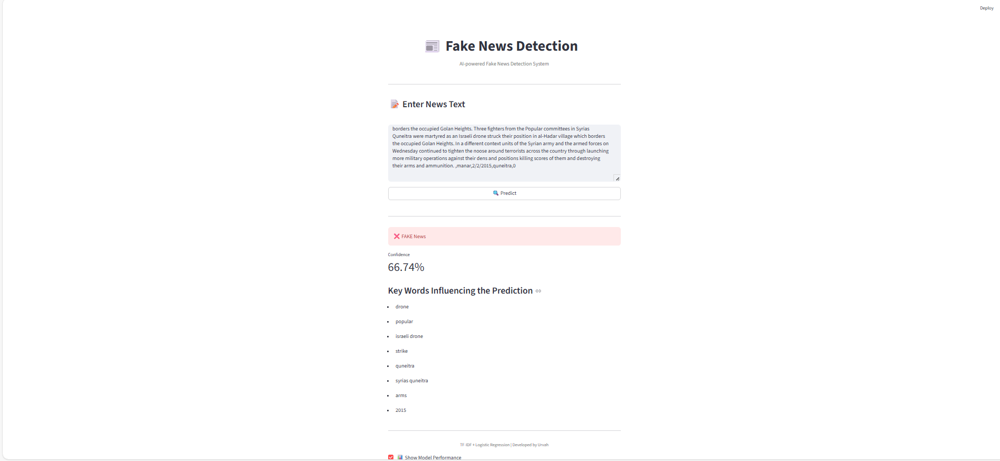

# Fake News Detection using Machine Learning 
## Project Overview  

This project implements a Fake News Detection system using Python and classical Machine Learning techniques.
The system allows users to input a news article and predicts whether it is REAL or FAKE. It also displays prediction confidence, model evaluation metrics, and an explanation of the most influential words used in the decision.

The application uses Streamlit for the frontend and Logistic Regression for classification.

## Live App :
https://fake-news-detection-h6yg8dcyttoyorj4whs8kg.streamlit.app/

## Dataset 

- File: news.csv

- Size: Approximately 800 news articles

### Labels:

- 0 – Fake News

- 1 – Real News

The dataset is used only during model training.

## Machine Learning Pipeline  

- Load dataset (news.csv)

- Combine article title and content

- Clean and preprocess text

- Convert text to numerical features using TF-IDF

- Split data into training and testing sets

- Train Logistic Regression model

- Save trained model and vectorizer as .pkl files

- Load saved model in Streamlit for prediction on new user input

## Features

- Fake / Real news prediction

- Confidence score

- Model evaluation (Accuracy and Confusion Matrix)

- Article-specific explanation showing top influencing words

- Streamlit-based web interface

## Model Performance  

Accuracy typically ranges between 50%–60%, depending on training runs.

Note: Performance is limited due to the small dataset size.

## Application Preview

### Home Screen

### Prediction Result

## How to Run the Project 
### Install dependencies : 

pip install -r requirements.txt

Train the model : 
python read_data.py

 Run the Streamlit application:
streamlit run app.py

## Limitations 

- Small dataset (~800 samples)

- Fake news classification is inherently complex

- Logistic Regression is a basic ML model and may not capture deeper semantic patterns

## Technologies Used

 - Python

 - Pandas

 - NumPy

 - Scikit-learn

 - Streamlit

 - TF-IDF Vectorizer

 - Logistic Regression

## Project Developer
Urvah Mansuri